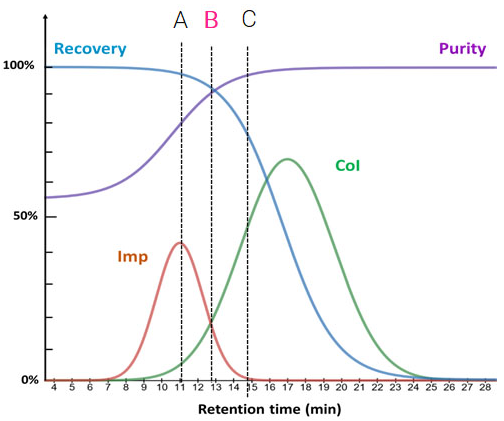
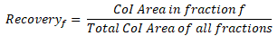
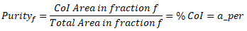
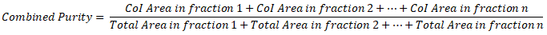
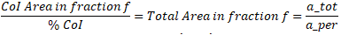
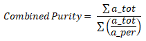

# Fraction selector

> Note: The core program was developed as a separate project named 'Flashcrom pooler'. The following document was created for that project, so some differences may appear and some functionality may have been modified to pursue some other targets more specific to the real life application.

When purifying a compound by flash [chromatography](https://en.wikipedia.org/wiki/Chromatography), all the fractions that have the compound of interest (CoI) must be analyzed to know the purity of each fraction and the total quantity of the CoI in each of them, as to choose which ones are interesting enough and continue with the isolation of this compound.
This fraction selection can be easy if the separation is good enough, but can be very tricky if the chromatography is not perfect.
The aim of this program is to make the best choice optimizing purity and recovery (yield), out of the analytical data obtained for each fraction.

## Example chromatogram

In the figure below (Credit: [Rotachrom](https://rotachrom.com/an-introduction-to-chromatography-chromatogram-fraction-collection/)) a sample chromatograph is shown, where 2 compounds are lightly overlapped.


The Imp and CoI lines show the quantity of each of this compounds after certain elution time. The resulting purity and yield (recovery) depend on which time the output solvent starts to be collected. In a typical experiment this output of the column is collected in several fractions.

In this example, if the fraction collection starts at point C (15 min) the pool will show 99% purity but a recovery of only 70%. If the collection starts at point B (13 min) then the pool will have a purity of 93% and the recovery will be of 93%. Finally, if collection starts when the CoI almost starts to elute -point A (11 min)- the recovery will be very high (99%) but the purity will only be around 70%.
In this case, there would probably be several fractions collected between 11 and 15 minutes of elution, so a decision has to be made to choose which of them lead to the best purity/recovery ratio, based on certain rationale.

## How does Flashchrom Pooler work

Once the elution is finalized, all the fractions are analyzed to quantify the CoI (at least) in each of them, and this data is the input that the program takes to choose the fractions that must be mixed together to obtain the desired purity & recovery results.
The program then calculates the purity & recovery values with all the fractions and then optimizes these values by unselecting fractions that do not meet certain selection criteria.
> Note: This criteria is currently hard-coded as three rules, but will further be passed into the program through a config file (see todo list).

## Program structure

### Modules and libraries

The program uses the following modules/libraries:
- Tabulate (package: tabulate)
- FPDF2 (package: fpdf2)

### **Part 0: Classes definition**

Two classes are used in the program:
- Fractions to handle data and calculations
- PDF for output

#### Fractions
Parameters passed into during instantiation:
* HU:     Handling Unit or fraction number
* a_per:  Value of the Area % of the CoI in the fraction
* a_tot:  Absolute area of the CoI in the fraction

Other attributes calculated or defined during instantiation:
* all_peak: ratio of the Absolute Area and Area % of the CoI in the fraction that will later be used to calculate the combined purity of the pool.
* collect: If the fraction is in the pool, the value is True. If discarded, false
* percent_product: ratio that indicates how much product there's in this fraction with respect to all the fractions.
* discarded_by: If the fraction is discarded, this attribute shows the reason why.

#### PDF
The PDF is structured in 3 Sections: Sample data, analytical data and calculations results. The section_title method is used to create this structure.

### **Part 1: Load batch information**

The first section of the report shows the test and sample identification. The batch information is provided as a separate .csv file `batchid.csv` which consists of only 1 line with the values:
```
Project family, Process Step, IPC#, Run or Sample ID
```

### **Part 2: Load analytical data**

*_Input_*

The program takes as an input another simple .csv file ([example.csv](example.csv)), where each line has 3 data values separated by a comma:

fraction number,CoI Area%,CoI absolute area

```
...
9,0.0,0
10,2.8,123456
11,8.7,493824
...
```

> Note: Only fractions with area greater than 0 must be included in this list. There's no need to have correlative fraction numbers

Some lists are created to classify the data and to pass these values to the `Fractions` objects
```
hu_list = []        # HU: Handling Unit = Fraction no.
aper_list = []      # aper: Area Percent
atot_list = []      # atot: Total Area
input_data = []     #.csv data transformed into a list
```

### **Part 3: Check data and create data objects**

As part of the data verification, a table is generated with the acquired data from the input file and shown in the terminal.
* createfractions()

The information shown in this table is used to populate the data objects with the `createfractions()` function. This function generates a dictionary where the keys are taken from the `hu_list` list and the values are `Fraction` classes, created by this function. The classes instantiated within this function take the information from the previous lists `aper_list` & `atot_list`, that are passed as arguments into `createfractions()`

* total_product_percent()

The `total_product_percent()` function is called to calculate the % CoI quantity of each fraction with regard to the total set of fractions. In this point, it doesn't matter the purity of each fraction. The calculation is done with the absolute area to know how much quantity of CoI is there in each fraction.
This function returns no output value, but sets the `percent_product` attribute of each fraction in the `f_d` dict to the calculated value. It's calculated only once after loading the fractions data into the dictionary created by `createfractions()`.

Then, the rules, the target recovery and purity values are set (currently hard-coded to 80% and 95% respectively, but in a near future this will be read out from a config file)

* rules

The rules are input as a list of tuples. Each individual rule is a tuple consisting of the cutoff value for the % CoI (`a_per`), and the `percent_product`.
```
    rules = [(80, 2), (80,100), (90, 2)]
```
This means that after testing the complete fractions set, then the first rule (80, 2) will be applied to unselect the fractions that don't meet this minimum criteria.
In this case, 80 would be the `a_per` threshold (i.e. all the fractions that have an `a_per` value less than 80) and 2 the maximum `percent_product`. Only the fractions that meet **both criteria at the same time** will be unselected, for instance:
```
Fraction 1: a_per = 75%, percent_product = 40%    # won't be discarded, as 40 > 2
Fraction 2: a_per = 81%, percent_product = 1%     # won't be discarded, as 81 > 80
Fraction 3: a_per = 75%, percent_product = 1%     # fraction discarded, as 75 < 80 AND 1 < 2
```

* optimize()

This is the core function of the program. This function runs the loop of testing all the fractions that are considered within the pool (i.e. `.collect` attribute of the `Fraction` == True ) to see if the target recovery and purity is met (by calling the `purity()` and `recovery()` functions).
If the pool doesn't meet this targets, then the first rule is applied, the corresponding fractions are `unselect()`ed and the recovery and purity are calculated again.
This iteration continues with all the rules in the `rules` list until the targets are met.
If the program runs out of rules, then the `unselect_low_purity()` function is called, which precisely starts to unselect the fractions with the lowest purity one by one, recalculating the recovery and purity parameters until the target is met.

* recovery()

The recovery ratio is the quotient between the total Area of the CoI in the fraction(s) divided by the total Area of the CoI in ALL the fractions. In case that several fractions are considered together (pooled), then the CoI Area used in the calculation is just the sum of each of the fractions' individual CoI Area's.



* purity()

The purity of a fraction is defined as the ratio between the CoI Area in the fraction and the Total Area of all the integrated peaks in this same sample:


> This value is one of the data fields from the input .CSV file

When several fractions are pooled together, then the purity is a weighed average of each of the individual fraction's purity values. Basically, it's the same quotient than for the purity formula for one fraction, but the ratio is between the sum of the CoI's Areas of each fraction and the sum of the total area for all the peaks of the pooled fractions:



Playing around with the first expression of the fraction purity and rearranging some terms, the Total Area for all the peaks of one fraction can be expressed as the quotient between the total CoI area (`a_tot`) and the % CoI (`a_per`) in the fraction:



Finally, replacing this expression in the combined purity, we arrive to the final formula:




* pooled_list

Once the fractions that allow the target recovery and purity to be met, then a list with the fraction's identification (`HU`) of the pool is created to be used as a reference for the output.

### **Part 4: Output**

After applying the rules there are two possible outcomes:

- Unsuccessful result: the program exits with a 'Target recovery of 80 % not met.' message.
- Successful result: a PDF report is generated, with all the information used in the problem resolution

> Note: This target recovery of 80% is also hard-coded at the moment of submitting this project, but will be passed into the program through a config file.

The reports are generated as PDFs by using the fpdf2 library. This package can create tables out of tuples, so the information of the pooled fractions must be translated from lists and a dictionary to a tuple of tuples, and this is exactly what the `list_of_tuples` list and `input_data_tuples` tuple are created and used for.
Finally, the report is created and the program ends.
